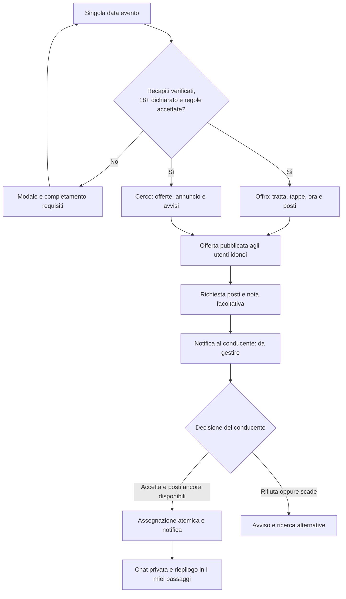

# Car pooling gratuito, chat e notifiche della community

Data: 18 settembre 2026. Stato: **piano da approvare; implementazione non avviata**.

Questo documento recepisce la richiesta e le risposte del proprietario, integra il codice esistente e definisce i criteri di rilascio. Le regole indicate come «proposte» sono scelte consigliate, non decisioni già approvate. Il piano dei test è in [TEST-CARPOOLING-COMMUNITY.md](TEST-CARPOOLING-COMMUNITY.md). La [matrice di confronto dei repository](CONFRONTO-FUNZIONI-CARPOOLING.md) documenta le opzioni esaminate nel codice e quelle riprese: il proprietario ha chiesto esplicitamente di conservarne le funzionalità utili anche senza importare le applicazioni intere.

Il confronto copre **40 aree funzionali**; il collaudo definisce **233 scenari di accettazione** da tradurre in test durante l'implementazione. Le fonti sono fissate alle revisioni esaminate e i comportamenti proposti valgono per web e Android.

## 1. Decisioni acquisite

| Tema | Decisione del proprietario |
|---|---|
| Destinazione | Passaggi collegati a una singola data di un evento, su sito desktop/mobile e app Android nativa |
| Accesso operativo | Conducente e richiedente con email confermata e WhatsApp verificato; niente deroghe per i gestori dei locali |
| Età | Solo maggiorenni |
| Dichiarazione | Inserire una dichiarazione esplicita di maggiore età, come richiesto dal proprietario |
| Accompagnatori | Possono essere non verificati; chi prenota rimane l'interlocutore verificato |
| Prezzo | Il passaggio è sempre gratuito |
| Offerta | Il conducente dichiara i posti disponibili |
| Richiesta | Scelta del numero di posti e messaggio iniziale facoltativo; il conducente deve accettare |
| Chat | Privata per richiesta, tra conducente e richiedente, disponibile dopo l'accettazione |
| Notifiche | Richiesta, accettazione e sviluppi del passaggio; badge chiari su desktop, mobile e Android, anche per il social |
| Amministrazione | Tracciabilità e gestione dei problemi riservate allo staff amministrativo della piattaforma, non ai locali |
| Tracciamento | Registrare gli IP delle operazioni rilevanti per sicurezza e gestione di eventuali richieste dell'autorità |
| Conversione | Pulsanti visibili anche ai non verificati, con modale che accompagna a registrazione/verifica |
| Documenti | Aggiornare termini e informativa privacy, coerentemente con servizio e conservazione |
| Sequenza | Prima piano completo; realizzazione nel passaggio successivo |

Interpretazione dell'età: maggiorenni anche gli accompagnatori. Per questi ultimi il richiedente dichiara maggiore età e autorizzazione a organizzare il passaggio; non promettiamo una verifica anagrafica. Email e WhatsApp attestano il controllo dei recapiti, non patente, identità civile o affidabilità alla guida.

## 2. Punto di partenza verificato nel repository

- Laravel 13/PHP 8.4, MariaDB, Blade/Alpine, Filament 5, Sanctum e Android Compose. Le funzionalità condividono servizi e policy lato server.
- `User::isWhatsappVerified()` comprende email, impronta del telefono, sospensione community e account non cancellato. Per introdurre restrizioni distinte bisogna separare la prova dei recapiti dalle autorizzazioni social/carpool, conservando il comportamento delle policy esistenti. Le sospensioni community pregresse vanno migrate conservativamente come restrizioni generali della community, senza riabilitazioni implicite.
- `CommunityAccess` applica blocchi reciproci e visibilità. La visibilità del profilo social non può diventare un requisito implicito per offrire un passaggio.
- `CommunityNotification` scrive solo nell'archivio database. `/avvisi` e l'API `/api/v1/me/notifications` esistono; l'API include il totale non letto e lettura singola/globale. Non esiste ancora una semantica comune per badge social, richieste e conversazioni.
- FCM e Web Push sono già integrati per altri avvisi. Riutilizzare registrazione dispositivi, preferenze, gestione token e trasporto, aggiungendo notifiche transazionali per passaggi/chat.
- La pagina admin `Community` gestisce profili/post/commenti/restrizioni; va evoluta in risorse Filament, casi di moderazione e permessi granulari.
- `spatie/laravel-permission` e `spatie/laravel-activitylog` sono già presenti. `SecurityLog` registra oggi IP e agente in proprietà JSON: non duplicare indiscriminatamente questi dati nei nuovi registri.
- Esiste impersonificazione amministrativa: impedirle di inviare messaggi, accettare passaggi o aggirare l'accesso controllato alle chat.
- I termini in `PageSeeder` contengono ancora la frase «non prende prenotazioni». Va riesaminato il testo completo anche rispetto al ticketing già implementato, non aggiunta soltanto un'appendice.
- Hosting attuale condiviso e worker/scheduler già in uso. Il supporto operativo a WebSocket persistenti deve essere dimostrato prima di attivare Reverb.
- Il futuro trasferimento comporta dominio e **nuovo account**: vale [DOMINIO-DEFINITIVO.md](DOMINIO-DEFINITIVO.md), inclusi push, WebSocket, firme Android e nuove credenziali dei servizi.

## 3. Valutazione dei progetti proposti

Verifica delle fonti al 18 settembre 2026; non è stata eseguita alcuna installazione.

| Progetto | Evidenza | Scelta proposta |
|---|---|---|
| [Carpoolear frontend](https://github.com/STS-Rosario/carpoolear) | Applicazione Vue/Cordova completa. Il file LICENSE è LGPL-3.0, mentre il README menziona GPL-3.0 | Riferimento per flussi e casi d'uso; non sostituisce Blade/Compose. Chiarire la licenza prima di un eventuale riuso di codice |
| [Carpoolear backend](https://github.com/STS-Rosario/carpoolear_backend/blob/master/composer.json) | Applicazione Laravel 12/PHP 8.5, autenticazione JWT. LICENSE/README GPL-3.0, composer indica MIT | Non è un pacchetto installabile nel nostro dominio. Evitare un secondo backend e la migrazione dello stack; nessun codice copiato senza chiarimento licenza |
| [rimadjamaa/CarPooling](https://github.com/rimadjamaa/CarPooling/blob/master/composer.json) | Applicazione Laravel 10/Sanctum 3; composer dichiara MIT ma il repository non espone una licenza identificata da GitHub | Riferimento funzionale, non dipendenza di produzione |
| [musonza/chat v6.15.2](https://github.com/musonza/chat/releases/tag/v6.15.2) | Pacchetto MIT; [composer della versione](https://github.com/musonza/chat/blob/v6.15.2/composer.json) dichiara Illuminate 12/13 | Candidato scelto per conversazioni, partecipanti, messaggi e letture; compatibilità risolta e provata prima dell'integrazione |
| [AI Chat Starter Kit](https://github.com/pushpak1300/ai-chat) | Il repository collegato dall'articolo propone chat con modelli AI, Prism, Inertia e Vue | Non serve per conversazioni private fra persone; non introdurre AI o inoltro dei messaggi a modelli |
| [Laravel Reverb](https://laravel.com/docs/13.x/reverb) | Server WebSocket ufficiale con processo persistente, proxy TLS, gestione processi e origini autorizzate | Trasporto in tempo reale preferito dove l'hosting lo supporta; la correttezza rimane nell'API e nel database |

L'applicazione mantiene il proprio dominio `Carpool`, senza importare un marketplace generico. `musonza/chat` è dietro un servizio `RideConversationService`, così le autorizzazioni dipendono dal passaggio accettato, non soltanto dall'appartenenza a una conversazione.

Verifica iniziale del pacchetto: risoluzione Composer in checkout isolato senza modificare lo stack, `composer audit`, migrazioni MariaDB, cifratura, letture concorrenti, cancellazione/export, controllo delle query e delle risorse pubbliche. Nessuna dipendenza `dev-*` per aggirare incompatibilità. Se un requisito essenziale fallisce, registrare una decisione motivata sull'alternativa prima di procedere.

Configurazione prevista: `should_load_routes=false`, `participant_models=[User::class]`, whitelist minima dei campi mittente, `encrypt_messages=true`. Le rotte pubbliche sono nostre; i broadcast del pacchetto restano disabilitati e sono sostituiti da eventi minimali autorizzati. Queste opzioni sono presenti nella [configurazione ufficiale](https://github.com/musonza/chat/blob/v6.15.2/config/musonza_chat.php).

## 4. Percorso utente e accessibilità

### 4.1 Nella scheda evento

Sezione «Andiamo insieme» vicino a luogo/indicazioni, con etichetta «Passaggi gratuiti» e due azioni: **Cerco passaggio** e **Offro passaggio**. Sulla pagina di una serie si seleziona prima la singola data. Per un evento annullato, oppure quando sono terminate anche le finestre consentite per il ritorno, le azioni diventano uno stato informativo coerente. La sola fine dell'evento non impedisce un ritorno ancora futuro e ammesso dalle finestre della sezione 5.2.

I pulsanti restano visibili agli ospiti e agli iscritti non verificati. Il modale dipende dal requisito mancante:

| Stato | Azione nel modale |
|---|---|
| Ospite | Crea account / Accedi, spiegazione breve della gratuità e delle verifiche |
| Email non confermata | Conferma email e reinvio con limiti |
| WhatsApp non verificato | Verifica gratis WhatsApp |
| Maggiore età/regole non dichiarate | Dichiarazione 18+ e accettazione delle regole del car pooling |
| Sospeso | Spiegazione della limitazione e collegamento ad assistenza; nessun invito a creare un altro account |

Salvare solo la destinazione interna e l'intento, con scadenza, e tornare alla data dopo l'onboarding. Ricontrollare disponibilità: la verifica non prenota e non pubblica automaticamente nulla. Le informazioni personali sulle offerte sono visibili solo a utenti idonei; gli altri vedono introduzione e invito.

La dichiarazione compare nel primo accesso operativo al car pooling e nel profilo, sezione «Verifiche e requisiti → Passaggi». Testo: **«Dichiaro di avere almeno 18 anni»**, casella non preselezionata, distinta dall'accettazione delle regole. Non richiedere data di nascita completa o documento per questa autodichiarazione. Memorizzare utente, testo/versione e timestamp dal server; mostrare «Maggiore età dichiarata», mai «Età verificata». Il server respinge ogni operazione che richiede il requisito quando manca. Per una richiesta con accompagnatori aggiungere **«Dichiaro che anche i miei accompagnatori hanno almeno 18 anni e sono informati delle regole del passaggio»**, nuovamente a ogni richiesta di gruppo. Nessun automatismo che dichiari l'età per conto dell'utente.

Accessibilità: focus contenuto nel modale, chiusura con Escape/indietro, restituzione del focus al pulsante, errori associati ai campi, tastiera e TalkBack, etichette testuali dei badge, nessuna informazione affidata soltanto al colore. Tocchi 48 dp e compatibilità con font ingranditi e temi esistenti.

Dal profilo si può rettificare o revocare la dichiarazione: il server disabilita subito nuove operazioni e scrittura in chat, annulla gli accordi futuri coinvolti e conserva la rettifica nell'audit. Il ripristino non riapre i passaggi annullati. Nessuna età viene dedotta dal numero WhatsApp o assegnata dallo staff al posto dell'utente.

### 4.2 Offro passaggio

Campi proposti:

- Data dell'evento già selezionata e tratta **verso l'evento / ritorno**. Si possono creare entrambe, ma restano due offerte e due disponibilità indipendenti.
- Comune/zona di partenza e destinazione; per l'andata la destinazione è il luogo della data, per il ritorno la partenza è l'evento. Non pubblicare indirizzi domestici.
- Ora di partenza con data esplicita, particolarmente importante per il ritorno dopo mezzanotte. Nessun calcolo alternativo a `EventOccurrenceQuery` per lo stato dell'evento.
- Posti passeggeri offerti, proposti da 1 a 8, escluso il conducente; non dichiarare posti superiori a quelli consentiti al proprio veicolo.
- Nota pratica facoltativa, massimo 500 caratteri, ad esempio bagagli o punto pubblico indicativo. Modello/colore del veicolo facoltativi e condivisi solo dopo l'accettazione; niente obbligo di targa/documenti.
- Tappe intermedie facoltative, fino a tre, con zona/punto pubblico e ordine; selezione della tappa di salita nell'andata o discesa nel ritorno. Orari stimati coerenti e ordinati, sempre dichiarati dal conducente; la scadenza per richiedere/accettare resta la partenza iniziale. Mappa dei punti dichiarati e apertura delle indicazioni nell'app mappe, senza calcolare un percorso stradale garantito. Nessun inventario di posti per segmenti nella prima versione: ogni richiesta occupa i posti su tutta la tratta.
- Preferenze strutturate: auto non fumatori, animali ammessi/da concordare/non previsti, bagaglio consentito, eventuale massimo due passeggeri dietro. Rendere visibili queste informazioni prima della richiesta; niente campi sanitari o filtro per genere.
- Garage privato facoltativo e modelli riutilizzabili: selezionare la propria auto e copiare impostazioni per un'altra data. La copia crea una bozza con capacità da confermare, non replica persone, chat, accettazioni o documenti legali già sottoscritti.
- Dichiarazioni: maggiore età, patente valida per il veicolo, veicolo idoneo e copertura assicurativa richiesta, gratuità integrale. Si tratta di dichiarazioni, non certificazioni eseguite dalla piattaforma.

Una sola offerta attiva per conducente/data/tratta. Le liste mostrano nome pubblico, badge corretto, zona, ora, posti residui e pulsante per richiederli. Non mostrare numeri di telefono, IP, roster passeggeri o punto preciso di incontro.

Il profilo social può restare privato: l'utente autorizza una scheda minima limitata al car pooling. Gli avatar sono serviti con policy coerente anche in questo contesto, senza aprire il profilo social agli estranei.

Condivisione volontaria del link all'offerta tramite gli strumenti del dispositivo: il collegamento conserva tutti i controlli di accesso e non contiene recapiti o coordinate private. Non invia automaticamente messaggi ai follower.

### 4.3 Cerco passaggio

«Cerco passaggio» apre anzitutto le offerte. Filtri: tratta, zona/tappa, fascia oraria, posti richiesti, bagagli e preferenze pratiche. Ordinamento iniziale per partenza, con alternativa più recenti; nessuna distanza precisa calcolata dall'IP. Dopo il confronto con Carpoolear, la proposta include anche un annuncio facoltativo «Cerco un passaggio» per la stessa data/tratta, con zona, fascia oraria e numero di posti, senza pubblicare recapiti o punto privato di incontro.

L'utente seleziona i posti **incluso il proprio** e aggiunge eventualmente un messaggio iniziale di massimo 500 caratteri. Il riepilogo dice, ad esempio, «3 posti: tu e 2 accompagnatori». Il richiedente viaggia e dichiara maggiorenni gli accompagnatori; non raccogliamo automaticamente nomi, numeri o documenti di persone senza account.

Il conducente vede chiaramente che gli accompagnatori non sono verificati dalla piattaforma. La dicitura «utenti verificati» riguarda i due account interlocutori, non tutti gli occupanti dell'auto.

Un solo click su «Richiedi 3 posti» invia la richiesta con i dati già impostati. Esito immediato: **In attesa di conferma**. Nessuna formulazione «prenotazione confermata» prima dell'accettazione. Il messaggio iniziale è una nota della richiesta: non apre una chat anticipata e non consente una conversazione aggirando l'accettazione.

Se mancano offerte, proporre altre zone/tratte, annuncio «cerco» e **«Avvisami quando c'è un passaggio»**. Le ricerche salvate sono private, facoltative e limitate alla singola data/tratta; si possono spegnere e scadono alla partenza. Avviso anche quando un'offerta piena torna ad avere i posti richiesti, senza riserva automatica. Chi riceve l'avviso deve inviare la normale richiesta.

Un conducente idoneo può rispondere a un annuncio proponendo una propria offerta coerente: un solo suggerimento per coppia annuncio/offerta, con limite di frequenza e controllo blocchi. Il richiedente riceve il collegamento e decide se richiedere; nessuna chat o accettazione automatica. Un annuncio attivo per utente/data/tratta, chiusura automatica dopo una prenotazione accettata o alla scadenza, riapertura esplicita dopo rinuncia. Le ricerche con avvisi vengono sospese quando il bisogno è soddisfatto.

### 4.4 Richiesta ricevuta e conferma

Il conducente riceve una notifica e vede la richiesta in «I miei passaggi → Da gestire», con nome del richiedente, numero totale posti, accompagnatori e nota. Azioni: **Accetta** / **Rifiuta**, senza obbligo di scrivere un motivo personale al richiedente.

Accettazione e rifiuto sono sempre POST autenticati: un link o una notifica apre il dettaglio, non esegue l'azione. All'accettazione il server ricontrolla tutti i requisiti, assegna i posti e crea la chat nella stessa transazione. L'utente riceve conferma con «Apri la chat».

### 4.5 Dove ritrovare tutto

- Desktop: campana Avvisi sempre riconoscibile; menu account con **I miei passaggi** e **Messaggi**.
- Mobile web: accesso Avvisi nell'header, badge sul Profilo se serve a raggiungerlo dal menu inferiore, collegamenti espliciti nel profilo. Evitare di aggiungere molte nuove voci alla barra inferiore.
- Android: campana e destinazioni native Passaggi/Messaggi, raggiungibili dal profilo e dal dettaglio evento; deep link anche ad app chiusa.
- «I miei passaggi»: tab **Offro**, **Cerco**, **Storico**, con richieste da gestire evidenziate.
- In «Cerco» sono raggiungibili anche annunci e ricerche con avvisi; in «Offro» le proprie auto, bozze e impostazioni riutilizzabili. Questi strumenti restano secondari rispetto alle richieste che richiedono una decisione.
- La scheda dell'evento mostra anche «Hai un passaggio confermato» oppure «La tua offerta: 2 richieste da gestire».
- La chat mostra sempre evento, data, tratta, ora, stato, posti e interlocutore, con collegamenti a passaggio e scheda evento. La richiesta di rendere la chat trovabile è affrontata con questi accessi; non viene introdotto tracciamento GPS delle persone.

## 5. Stati, posti e concorrenza

### 5.1 Regole invarianti

1. `posti_disponibili = posti_offerti − somma(posti delle richieste accettate e attive)`, sempre fra zero e capacità.
2. Le richieste in attesa non occupano posti. La disponibilità vista nell'elenco può cambiare; l'accettazione è l'unico punto di assegnazione.
3. Niente richieste alla propria offerta. Una richiesta attiva per richiedente/offerta.
4. Un richiedente non può avere due prenotazioni accettate sulla stessa data/tratta, né essere contemporaneamente conducente e passeggero per quella data/tratta. Andata e ritorno sono distinti.
5. Sono proponibili al massimo tre richieste in attesa per data/tratta; quando una viene accettata le alternative vengono ritirate atomicamente e i conducenti avvisati.
6. Accompagnatori senza account non sono deduplicabili per identità: il sistema garantisce i posti della richiesta, non l'assenza della stessa persona in gruppi diversi.
7. Il numero di posti non aumenta dopo l'accettazione senza nuova valutazione del conducente. Prima della partenza si può ridurlo mantenendo almeno il richiedente: liberazione atomica dei posti e avviso. Per aumentarlo, ritirare e inviare una nuova richiesta, spiegando che si perde la conferma precedente.
8. Il conducente può aumentare la capacità o diminuirla fino ai posti già assegnati; non può cancellare passeggeri silenziosamente cambiando un numero.
9. Ritiro/cancellazione ripetuti liberano i posti una sola volta. Nessuna cancellazione distruttiva della cronologia operativa.
10. Il server controlla stati, verifiche, blocchi e scadenze anche se l'interfaccia è aperta da ore.

### 5.2 Transizioni

| Oggetto | Stati proposti | Passaggi essenziali |
|---|---|---|
| Offerta | bozza, aperta, chiusa alle nuove richieste, sospesa per variazione evento, annullata, conclusa | Bozza visibile solo al proprietario, senza occupazioni/notifiche; pubblicazione con nuova validazione. Chiusura impedisce nuove richieste ma consente di decidere le pendenti e mantiene le conferme; «esaurita» è derivato dai posti, non uno stato indipendente |
| Richiesta | in attesa, accettata, rifiutata, ritirata, scaduta, annullata dal conducente/sistema | Accettata solo da in attesa; ogni transizione registra autore, origine e motivo codificato |
| Chat | attiva, sola lettura, oscurata per sicurezza | Creata una volta per richiesta accettata; nessuna riapertura automatica da nuovi messaggi |
| Caso admin | nuovo, assegnato, in esame, in attesa, risolto, riaperto | Ogni azione sensibile lascia una voce di audit |

Scadenze proposte: invio e accettazione fino all'ora di partenza; nessuna accettazione successiva. Scheduler ogni minuto, ma controlli sincroni obbligatori. L'offerta si conclude 24 ore dopo la partenza dichiarata se non annullata; questo significa **archiviazione**, non prova che il viaggio sia avvenuto. Chat attiva fino a 24 ore dopo la partenza, poi leggibile durante la conservazione. Dopo cancellazione, chat subito in sola lettura con messaggio di sistema. Assenze o problemi sono segnalazioni, non fatti attestati automaticamente.

La riapertura di un'offerta chiusa è esplicita e possibile soltanto prima della partenza, ricontrollando requisiti e stato dell'evento. Non riattiva richieste rifiutate, ritirate o scadute.

Anche senza confermati, una modifica sostanziale incrementa la revisione delle condizioni e invalida le richieste pendenti e i suggerimenti relativi alla versione precedente, avvisando gli interessati. La sola variazione consentita della capacità aggiorna disponibilità e versione dei dati, senza trasformare il consenso alle condizioni. Il conducente non può accettare una richiesta riferita a condizioni ormai diverse.

Gli orari delle tratte sono validati rispetto alla data dell'evento con finestre esplicite/configurabili: proposta andata da 24 ore prima dell'inizio fino alla fine effettiva, ritorno dall'inizio fino a 24 ore dopo la fine effettiva. Sempre `EventOccurrenceQuery` per selezione, annullamento e fine evento; nuova logica temporale centralizzata in una query Carpool per la partenza della tratta. DST, eventi su più giorni e ritorni notturni devono essere coperti.

### 5.3 Assegnazione atomica

Servizi espliciti `CreateRideOffer`, `RequestRideSeats`, `AcceptRideRequest`, `DeclineRideRequest`, `WithdrawRideRequest`, `CancelRideOffer`, `ReconcileRideEligibility`.

L'accettazione apre una transazione MariaDB, blocca gli utenti interessati in ordine deterministico, le offerte e le richieste coinvolte, ricontrolla la revisione dell'offerta e assegna i posti. Considerare anche le alternative da ritirare: ordine utenti → offerte → richieste, ordinato per ID in ciascun gruppo, con ricontrollo del perimetro prima di scrivere. Una tabella di occupazioni attive con vincolo unico `(user_id, occurrence_id, leg)` tutela anche l'esclusività tra offerte diverse. Lock, ordine uniforme e retry limitato dei deadlock coprono tutti i percorsi che liberano/assegnano posti; i vincoli database restano l'ultima difesa.

Chiave idempotente associata a utente, azione e hash del payload per creazione/richiesta/accettazione/invio messaggio. Stessa chiave e stesso contenuto restituiscono lo stesso risultato; contenuto diverso è rifiutato. Errori 409 strutturati per posti non più disponibili, revisione cambiata o stato superato; niente contatori ottimistici permanenti nel client.

Notifica nell'archivio e record outbox scritti nella transazione della transizione. La consegna push avviene dopo il commit, con deduplica per destinatario/evento/versione; retry della coda non genera una seconda conferma. Prima di consegnare, ricontrollare visibilità e stato per non inviare «accettata» quando è già stata annullata.

## 6. Annullamenti, cambiamenti e sicurezza tra utenti

| Situazione | Comportamento proposto |
|---|---|
| Richiedente rinuncia prima della partenza | Libera tutti i posti della richiesta, avvisa il conducente, chat sola lettura |
| Conducente cancella | Annulla richieste pendenti e confermate, avvisa ogni richiedente, conserva la storia |
| Modifica sostanziale dopo una conferma | Bloccare modifica diretta di data/tratta/zona/orario/tappe utilizzate o preferenze concordate; annullare e proporre nuova offerta, senza trasferire silenziosamente le accettazioni |
| Evento annullato o non più accessibile | Sospensione immediata delle operazioni, cancellazione idempotente dei passaggi futuri e notifiche; snapshot minimo per storico e segnalazioni |
| Evento spostato nel tempo/luogo | Sospendere offerte, annullare le precedenti conferme con motivo evento modificato e avvisare. Il conducente ripropone orari aggiornati; i passeggeri richiedono nuovamente, senza consenso presunto |
| Verifica email/WhatsApp o dichiarazione 18+ revocata; account sospeso globalmente/carpool o cancellato | Bloccare subito nuove azioni/chat; cancellare offerte o richieste future coinvolte e avvisare gli altri. Nessuna riattivazione automatica dopo ripristino |
| Blocco tra utenti | Bloccare richiesta/chat e annullare la loro eventuale prenotazione futura; gli altri passeggeri non cambiano. Mostrare avviso prima del blocco, senza impedire il blocco |
| Segnalazione | Possibile dal passaggio o messaggio; non annulla automaticamente né prova la violazione. Lo staff può intervenire con motivazione |
| Problema durante/dopo la partenza | Consentire segnalazione e azioni di sicurezza; non rimettere sul mercato posti di una tratta già partita |

Una restrizione esclusivamente social disabilita le facoltà social previste ma non revoca da sola i recapiti né cancella passaggi; una restrizione carpool disabilita solo il carpool; una restrizione generale interessa entrambi. Lo staff vede questi effetti prima di confermare. I blocchi reciproci continuano invece a valere in entrambi gli ambiti.

Le notifiche di cancellazione/sicurezza restano consultabili dai destinatari anche se hanno perso il diritto di creare nuovi passaggi. Non devono contenere informazioni private di un utente che li ha bloccati. La sola perdita di verifica permette di consultare il proprio storico già autorizzato, in sola lettura e fino a scadenza. Per una sospensione di sicurezza che oscura una conversazione rimangono visibili stato e accesso all'assistenza, non il contenuto oscurato. Nessun accesso a contenuti nuovi dopo la revoca.

## 7. Chat privata contestuale

- Due account partecipanti immutabili: conducente e richiedente. Nessun invito agli accompagnatori, chat generica, ricerca globale di persone da contattare o chat con i locali.
- Una conversazione per richiesta, non una conversazione unica per coppia: due eventi diversi non condividono messaggi. Non usare una modalità del pacchetto che deduplichi tutte le conversazioni dirette della stessa coppia.
- Testo semplice, limite proposto 2.000 caratteri, invio con identificativo client per evitare doppioni. Stati locale/invio riuscito/errore e possibilità di ritentare lo stesso messaggio.
- Prima versione senza allegati, audio, posizione live, anteprime remote dei link, modifica retroattiva o cancellazione irreversibile da parte degli utenti. Si può segnalare un messaggio e archiviare la conversazione senza alterare quella dell'altra persona.
- Il messaggio iniziale della richiesta resta nel riepilogo. Sistema e utenti hanno autori chiaramente distinti; nessun admin può scrivere fingendo di essere un partecipante.
- Testo cifrato a riposo e TLS in transito; **non** dichiarare cifratura end-to-end, perché l'accesso dello staff per casi autorizzati rimane previsto e documentato.
- Invio, lettura, paginazione, ricevute e sottoscrizione canale verificano policy e partecipazione. ID opachi non sostituiscono l'autorizzazione.
- Cronologia con cursore stabile, caricamento incrementale, watermark dell'ultimo messaggio visto. La lettura non segna come letti messaggi arrivati successivamente.
- Il punto preciso di incontro può essere concordato in chat dopo l'accettazione. WhatsApp verificato non implica condivisione automatica del numero; nessuna rubrica pubblica.
- Logout/cambio account elimina dati e sottoscrizioni del precedente account. Su Android niente cache in chiaro dei messaggi in file/log; per la prima versione cache solo in memoria. Screenshot del sistema e contenuti volontariamente condivisi dai partecipanti restano fuori dalla garanzia tecnica.
- Possibilità di silenziare le notifiche push di una chat mantenendo messaggi e badge interni. La scelta non cancella gli avvisi operativi del passaggio.

## 8. Un centro notifiche e badge coerenti

### 8.1 Modello comune

Estendere l'archivio esistente, senza creare un secondo centro avvisi indipendente. Contratto comune: ID, categoria (`social`, `carpool`, `chat`, categorie evento esistenti), tipo stabile, risorsa autorizzata, destinazione tipizzata, timestamp, lettura, eventuale azione richiesta e versione.

Per i nuovi dati salvare identificativi e destinazioni interne, non URL assoluti come fonte primaria; generare gli URL sul dominio corrente. Adattatore per notifiche storiche e vecchie versioni Android, con controllo dell'origine e senza redirect esterni arbitrari.

| Evento | Destinatario | Dove porta |
|---|---|---|
| Nuova richiesta | Conducente | Richiesta da accettare/rifiutare |
| Richiesta accettata | Richiedente | Passaggio confermato con chat |
| Rifiuto/scadenza | Richiedente | Richiesta e altre offerte |
| Rinuncia/riduzione posti | Conducente | Gestione offerta |
| Offerta annullata/evento modificato | Richiedenti coinvolti | Stato aggiornato e alternative |
| Nuovo messaggio | Altro partecipante | Conversazione e primo messaggio non letto |
| Nuova offerta compatibile/posti tornati disponibili | Utente che ha attivato la ricerca o l'avviso | Offerta ancora visibile e richiedibile |
| Offerta suggerita a un annuncio «cerco» | Autore dell'annuncio | Riepilogo offerta; nessuna richiesta automatica |
| Promemoria decisioni pendenti | Conducente | Tab Da gestire, aggregato e limitato |
| Promemoria partenza | Conducente e richiedenti confermati | Riepilogo incontro e chat |
| Nuovo follower/commento/risposta | Utente social coinvolto | Profilo/post/commento visibile secondo policy |
| Moderazione | Utente interessato e staff incaricato, con testi distinti | Provvedimento/ricorso oppure caso amministrativo |

Niente notifiche a sé stessi, doppioni da retry o contenuti di profili/post diventati privati o bloccati.

Promemoria proposti a 24 ore e 2 ore dalla partenza, senza recuperare entrambi se la richiesta è accettata più tardi. Le richieste pendenti possono generare un promemoria aggregato massimo ogni 24 ore, oltre agli avvisi iniziali. Avvisi di ricerca con deduplica per offerta/destinatario e raggruppamento; un'offerta ritirata o esaurita viene ricontrollata prima della consegna. Tutti gli invii esterni rispettano preferenze, quiet hours e stato corrente; l'archivio interno resta aggiornato subito.

### 8.2 Semantica dei contatori

- **Avvisi:** notifiche ordinarie non lette; la scheda Messaggi usa conversazioni con messaggi non letti. Il riepilogo globale somma avvisi non-chat e conversazioni non lette, mai anche ogni messaggio della stessa chat.
- **Da gestire:** numero delle richieste ancora pendenti del conducente. Leggere l'avviso non equivale ad accettare: questo contatore resta fino alla decisione/scadenza.
- **Messaggi:** una conversazione con cinque messaggi nuovi conta una volta sul menu, con numero messaggi interno se utile.
- **Social:** follower/commenti non letti confluiscono nella stessa campana e nel filtro Social. Non si aggiunge un secondo archivio.
- «Segna tutti come letti» agisce sugli avvisi fino a un watermark server, senza azzerare chat mai aperte o richieste da gestire. La dicitura lo rende comprensibile.
- Cifre limitate visivamente a `99+`, valore intero corretto nelle etichette accessibili; il colore accompagna sempre un testo.
- Server autorevole: risposta alle mutazioni include contatori/versione aggiornati; letture concorrenti e risposte fuori ordine non possono ripristinare valori vecchi.

### 8.3 Consegna e aggiornamenti

Archivio e badge interni sempre presenti. Push web/Android su permesso del dispositivo e preferenze esplicite; messaggi esterni generici, senza testo della chat, indirizzo preciso o IP sullo schermo bloccato. Le preferenze marketing non governano gli avvisi operativi. Nessun invio WhatsApp automatico per passaggi o chat: Kapso resta dedicato alla verifica.

Per il sito aperto e Android in primo piano: Reverb su canali privati quando disponibile; eventi con ID/versione e successivo recupero API autorizzato. Nessun testo sensibile incluso nei broadcast. Revoca/blocco fanno cessare i canali e invalidano anche i tentativi di recupero successivi.

Fallback iniziale utilizzabile sul server attuale: polling incrementale della chat ogni 5 secondi quando visibile, riepilogo badge ogni 30 secondi; stop in background, backoff in caso di rete/429, sincronizzazione immediata su focus/riapertura. Un coordinatore unico evita polling moltiplicato da più componenti. Rivedere i limiti API senza togliere le protezioni sugli invii.

Il push è un avviso, non una garanzia di consegna immediata. Aprire l'app recupera sempre lo stato dal server. La documentazione [Android sui badge](https://developer.android.com/develop/ui/views/notifications/badges) distingue i contatori interni dai pallini/contatori del launcher: questi ultimi dipendono da notifiche attive, permessi e launcher, quindi non sono promettibili su ogni dispositivo.

Criteri per attivare Reverb: processo supervisionato, WSS e proxy verificati, origini esplicite, restart al deploy, compatibilità client Android, autorizzazione Sanctum/sessione, test di revoca, riconnessione e perdita eventi. Sul nuovo hosting/account riconfigurare tutto; non acquistare un servizio esterno implicitamente.

## 9. Gestione admin social e car pooling

Un'area **Community e sicurezza** nel pannello amministrativo con dashboard, code di lavoro e scheda unica dell'utente. Le sezioni dei locali non ricevono queste risorse né API, conteggi o esportazioni.

| Area | Funzioni previste |
|---|---|
| Dashboard | Segnalazioni aperte, casi urgenti, richieste bloccate, errori notifiche, controlli retention e code; metriche aggregate senza anteprime di chat private |
| Utenti | Stato email/WhatsApp, numero mascherato, dichiarazione 18+, restrizioni social/carpool, storico provvedimenti, collegamento a contenuti e casi |
| Social | Profili, selezione redazionale, post, commenti, blocchi/restrizioni, ricerca/filtri, motivo obbligatorio per nascondere/ripristinare; tracciabilità anche dopo ritiro e ripubblicazione |
| Passaggi | Ricerca per evento/data/tratta/utente/stato; offerta, capacità, posti assegnati, richieste, revisioni e timeline leggibili insieme |
| Conversazioni | Metadati e collegamento al caso; contenuto accessibile solo con permesso dedicato e motivazione, non anteprima indiscriminata |
| Segnalazioni | Post/commento/profilo/offerta/richiesta/messaggio, gravità, assegnatario, note interne, evidenze, comunicazioni e ricorso |
| Assistenza | Casi con risposte private dello staff all'utente, modelli di risposta, contatori non letti separati, assegnazione e conflitto tra operatori; canale distinto dalla chat conducente-passeggero |
| Esiti dei passaggi | Feedback privato di conducente/richiedente dopo la tratta: viaggio effettuato/rinuncia/assenza dichiarata/problema, con contestazione e nessun voto pubblico o sanzione automatica |
| Audit e autorità | Ricerca autorizzata, IP mascherati per default, accesso motivato agli originali, preservazione circoscritta ed export con manifest e registro consegne |
| Notifiche | Esito per canale, tentativi, retry controllato, destinatario e collegamento; niente reinvio di contenuti ormai non autorizzati |

Permessi espliciti da aggiungere a `Permission` e ai seed dei ruoli: gestione social; gestione passaggi; gestione casi; lettura motivata chat; lettura dati di sicurezza; export evidenze; gestione conservazione. Utilizzare Spatie già installato, evitando un secondo sistema di ruoli.

I moderatori della piattaforma possono gestire i contenuti/casi assegnati secondo i permessi concessi. Solo admin/superadmin con permessi specifici accedono a chat integrali/IP/export. Owner/editor di un locale non ricevono questi privilegi neppure per l'evento che ospitano. Un utente con doppio ruolo ottiene accesso solo per il ruolo amministrativo esplicitamente assegnato, mai per l'associazione al locale.

Azioni: sospensione social, sospensione carpool o sospensione generale distinte; nascondi/ripristina; annulla offerta/prenotazione; congela conversazione; nota e chiusura caso; avviso motivato e possibilità di contestazione. Nessuna accettazione di passaggio al posto del conducente, modifica segreta dei messaggi o certificazione arbitraria del numero.

L'assistenza mantiene fili separati tra staff e ciascun interlocutore del caso: il segnalante non legge le risposte dell'altra parte e viceversa. Le note interne non sono messaggi all'utente; ogni invio mostra un destinatario esplicito. Le comunicazioni restano accessibili dal dettaglio segnalazione/assistenza, con badge e avvisi dedicati nel centro comune. Un feedback sul passaggio è ammesso solo a chi ha avuto una richiesta accettata, dopo l'orario previsto della tratta, anche se successivamente annullata: distinguere tale stato da un viaggio effettivamente dichiarato svolto. Una segnalazione urgente è invece possibile subito.

Ogni consultazione sensibile ed export registra operatore reale, caso/motivo, perimetro, timestamp e IP secondo retention. L'impersonificazione non può leggere chat/IP per aggirare questi controlli, inviare messaggi o agire sui posti. Accesso admin forte e recente per export/preservazione; download temporaneo protetto, file fuori dalla webroot, neutralizzazione formule CSV. L'esportazione per l'autorità richiede verifica della richiesta e viene eseguita da un incaricato, non inviata automaticamente.

## 10. IP, conservazione e documenti legali

### 10.1 Registro tecnico

Registrare gli eventi significativi di social/carpool/chat: creazione, richiesta, accettazione, rifiuto, ritiro, modifica, cancellazione, invio messaggio, blocco/segnalazione, provvedimento, accesso/export amministrativo, accettazione delle regole. Non registrare ogni aggiornamento dei badge o ogni polling come evento probatorio.

Dati: ID evento audit, soggetto, attore reale, risorsa/versione, azione, esito, timestamp UTC dal server, canale web/Android/admin, request ID, IP canonico IPv4/IPv6 e agente limitato. L'IP dei job asincroni deriva dal contesto catturato all'azione iniziale, non dall'IP del worker.

Gli IP sono cifrati in un archivio con accesso dedicato; le timeline generiche contengono riferimenti e IP mascherati. Una eventuale impronta HMAC per correlazione ha chiave separata. Non duplicare IP grezzi o testo chat in activity log, Telescope, Sentry, analytics, notifiche e log HTTP applicativi. Inventariare anche i log dell'hosting/proxy: la retention dell'app non cancella da sola quelli esterni.

Fidarsi degli header proxy soltanto da proxy esplicitamente configurati; `X-Forwarded-For` inviato da un client non diventa una prova attendibile. Non raccogliere indiscriminatamente gli header, token o password. Nessuna geolocalizzazione dell'IP per individuare il punto di partenza.

Un IP è un indizio tecnico associato a un'operazione: non certifica identità, presenza fisica o assenza di VPN/NAT. Il registro deve documentare questi limiti. Audit append-only dal punto di vista applicativo e backup controllati migliorano la ricostruibilità; non promettere impossibilità assoluta di alterazione da parte dell'amministratore del server.

### 10.2 Durate proposte da validare

| Categoria | Proposta iniziale, non durata imposta dalla legge |
|---|---|
| IP grezzi e contesto tecnico | 90 giorni dall'operazione, poi cancellazione; per eventi futuri lontani il log può scadere prima del viaggio e questo limite va esplicitato |
| Messaggi e note private | 90 giorni dalla chiusura della tratta, poi eliminazione del contenuto e delle copie derivate |
| Storico operativo minimo | 12 mesi dalla chiusura, senza testo chat/IP scaduti, per assistenza e contestazioni; giustificare la necessità |
| Audit degli operatori | 12 mesi, con accesso ristretto; riesaminare IP associati secondo il termine breve |
| Casi di assistenza, risposte ed evidenze | 12 mesi dalla chiusura del caso come proposta da giustificare; nessuna copia integrale automatica della chat. Estratti necessari con provenienza, accesso ristretto e termine esplicito; eventuale preservazione separata |
| Bozze, modelli e garage | Disponibili finché utili all'utente; pulizia bozze inattive dopo 90 giorni proposta. Ritiro/cancellazione non altera gli snapshot di accordi già registrati |
| Preservazione per caso/richiesta valida | Solo dati pertinenti, motivazione e responsabile, revisione almeno ogni 90 giorni e scadenza; nessun blocco globale e perpetuo della cancellazione |

Questi valori sono ipotesi progettuali da approvare con chi segue privacy e aspetti legali prima dell'attivazione. Non esiste nel piano un obbligo inventato di tenere tutti gli IP «per l'autorità» senza scadenza. Il [Garante](https://www.garanteprivacy.it/home/principi-fondamentali-del-trattamento) richiede finalità, minimizzazione e conservazione proporzionata. Va individuata e documentata la base giuridica di ciascun trattamento, distinta dall'accettazione contrattuale; una possibile valutazione del legittimo interesse non è una scorciatoia automatica.

Export personale e cancellazione account devono includere i nuovi dati, tutelando i terzi. La cancellazione disabilita l'account e i viaggi futuri; eventuale conservazione limitata per una controversia viene separata e documentata, non resa pubblica. La procedura di ripristino backup riapplica eliminazioni/scadenze e vincoli di preservazione per evitare di ricreare contenuti già cancellati.

### 10.3 Termini e informativa

Preparare una nuova versione completa, con confronto revisioni, data di efficacia e storico accessibile. Contenuti richiesti:

1. Descrizione corretta di calendario, social, ticketing e car pooling; ruoli effettivi della piattaforma e dei partecipanti.
2. Passaggi integralmente gratuiti: niente prezzi, commissioni, rimborsi obbligatori, depositi o pagamenti richiesti fuori piattaforma come condizione del passaggio. Pulsante di segnalazione per richieste di denaro.
3. Maggiore età, requisito email/WhatsApp dei due interlocutori, accompagnatori non verificati dichiarati dal richiedente, limiti del badge.
4. Dichiarazioni del conducente e condotta dei passeggeri, accordo volontario, numero di posti, rinunce, puntualità e divieto di abuso/molestie/discriminazione.
5. Momento della conferma, assenza di promessa prima dell'accettazione, gestione di variazioni e annullamenti.
6. Chat contestuale e accesso dello staff autorizzato per assistenza/sicurezza; conservazione e trattamento dei dati, senza promettere segretezza end-to-end.
7. Moderazione, segnalazione, ricorso, gestione delle richieste dell'autorità e limiti delle evidenze tecniche.
8. Responsabilità e coperture da far verificare a un professionista in relazione al servizio effettivo; la gratuità da sola non risolve gli aspetti assicurativi o le responsabilità.
9. Titolare, contatti, fornitori, eventuali trasferimenti e diritti privacy aggiornati. Nessun consenso marketing implicito.

Accettazione esplicita della versione carpool prima di offrire/richiedere, non semplice continuazione d'uso. Registrare utente, versione/hash documento, dichiarazione 18+, timestamp e riferimento audit. Cambi sostanziali richiedono nuova accettazione per nuove operazioni; storico, rinuncia, segnalazione e gestione necessaria dei passaggi già confermati restano accessibili, senza costringere a nuovi termini per cancellare un viaggio.

Aggiornare pagine e seeder, preservando personalizzazioni e versioni precedenti; migrazione mirata e idempotente, mai eseguire il seeder generale sul sito pubblico. Non pubblicare in questa fase una bozza come testo già vigente.

## 11. Dati, API e integrazione

| Entità proposta | Responsabilità e vincoli |
|---|---|
| `ride_offers` | Conducente, occurrence, tratta, zona/ora, capacità, posti assegnati, stato, revisione; nessun campo prezzo |
| `ride_requests` | Offerta, richiedente, posti inclusivo del richiedente, nota cifrata, revisione offerta, stato e date delle transizioni |
| `ride_occupancies` | Occupazioni attive di conducente/richiedente, vincolo unico utente/data/tratta; legame a offerta o richiesta |
| `ride_conversations` | Legame univoco richiesta-conversazione Musonza, stato, scadenze, contesto minimo; partecipanti server-side |
| Tabelle Musonza | Messaggi cifrati, partecipazione e letture; nessun endpoint generico esposto |
| `carpool_profiles` | Dichiarazioni 18+/conducente, versione regole, eventuale restrizione specifica; niente patente/documenti come upload implicito |
| `ride_stops`, `user_vehicles`, `ride_templates` | Tappe ordinate, garage privato e impostazioni riutilizzabili; controllo proprietà, whitelist e snapshot dell'offerta per evitare modifiche retroattive tramite l'auto |
| `ride_wanted_posts`, `ride_search_alerts`, `ride_suggestions` | Annunci di ricerca, avvisi privati e proposte collegate a offerte; scadenze, blocchi e deduplica |
| `ride_feedback` | Dichiarazioni post-viaggio private, autore e richiesta; una per interlocutore, separate da una prova oggettiva di presenza |
| `legal_document_versions`, `user_legal_acceptances` | Documenti immutabili versionati e prova dell'accettazione |
| `moderation_cases`, `moderation_case_events`, `moderation_case_messages` | Segnalazioni, decisioni, motivazioni, assegnazioni, ricorsi e comunicazioni per destinatario, con collegamenti ai Report esistenti; note interne separate e nessun thread condiviso implicitamente tra segnalante e segnalato |
| `security_audit_events`, `evidence_holds`, `evidence_access_logs` | Contesto tecnico cifrato, preservazione circoscritta e consultazioni; riuso di Spatie per timeline priva di segreti |
| `notification_outbox` e notifiche esistenti | Consegna affidabile, categorie/tipi/versioni e chiavi uniche di deduplica |

Conservare gli ID dell'occorrenza, non copiare un evento come nuova fonte autorevole. Snapshot storico minimo utile anche se l'evento viene ritirato; impedire cascade distruttivi incompatibili con casi aperti e conservazione, senza eludere cancellazioni dovute.

API additive sotto `/api/v1`, con risorse/enum/errori coerenti con le convenzioni. Famiglie proposte:

- `GET /occurrences/{occurrence}/rides`, `POST /occurrences/{occurrence}/rides`;
- `GET/PATCH /rides/{ride}`, `POST /rides/{ride}/close`, `POST /rides/{ride}/cancel`;
- `POST /rides/{ride}/requests`, dettaglio richiesta e azioni `/accept`, `/decline`, `/withdraw`, `/reduce-seats`;
- `GET /me/rides`, `GET /me/conversations`, lista/invio messaggi e lettura con watermark;
- `GET /me/notification-summary`, estensione delle notifiche esistenti per filtri e lettura;
- endpoint per regole/accettazione e segnalazioni, integrati con gli equivalenti esistenti.
- endpoint proprietari per veicoli/modelli, annunci «cerco», ricerche con avvisi, suggerimenti e feedback; endpoint dedicati alle conversazioni di assistenza con lo staff.

Web e API chiamano gli stessi servizi: tutti gli input hanno Form Request e tutte le risorse Policy. Nessun client può scegliere autore, destinatario, partecipanti, IP, prezzo, stato o badge. Endpoint admin separati con autorizzazione anche sulle azioni Livewire, query, contatori ed export. Aggiornare la documentazione API e i contratti Android.

Limitare separatamente creazione di offerte/richieste/annunci, suggerimenti, invio messaggi, segnalazioni e accessi sensibili; quote per account e IP con risposta 429/Retry-After. Non usare il limite di lettura/polling come unica protezione antispam e non consentire di aggirare le quote alternando web e API. Limiti anche per bozze, modelli, ricerche attive, paginazione e dimensione payload, con valori configurabili e verificati sul carico reale. I limiti non devono impedire rinunce e segnalazioni urgenti per effetto di una quota di ricerca esaurita.

Indici: data/tratta/stato/partenza per offerte; offerta/stato e richiedente/stato per richieste; conversazione/ID per messaggi; destinatario/categoria/lettura per notifiche; soggetto/data e scadenza per audit. Paginazione obbligatoria, query senza N+1 e cache esclusivamente personale; HTML pubblico dell'evento non incorpora chat o badge di un altro utente.

## 12. Piano di realizzazione e criteri di completamento

Branch di implementazione proposto: `fix/carpooling-verificato`, da main aggiornato in checkout isolato per preservare le modifiche già presenti. In questo turno si producono soltanto documenti.

| Fase | Lavoro | Criterio per passare oltre |
|---|---|---|
| 0 — Contratto | Approvare proposte aperte, prova tecnica Musonza, scelte retention/documenti, misurare capacità hosting/worker | Compatibilità documentata; nessun dubbio su identità, gratuità, chat e posti |
| 1 — Fondamenta | Migrazioni additive, enum, policy, dichiarazioni/termini, vincoli posti, audit e flag | Test accesso, concorrenza, idempotenza e migrazioni verdi |
| 2 — Passaggi | Offerte, tappe/preferenze/auto, modelli, ricerca/annunci/avvisi, richieste, accettazione/rinunce, blocchi, modifiche eventi e scheduler | Percorso API completo e parità web/Android verificabili |
| 3 — Chat | Integrazione Musonza protetta, cifratura, chat per richiesta, letture, retention | Nessun accesso estraneo o pre-accettazione; invio/letture/retry corretti |
| 4 — Avvisi | Contratto unico, outbox, badge social/carpool/chat, FCM/Web Push, polling/Reverb | Contatori coerenti tra dispositivi, nessun doppione, recupero da guasti |
| 5 — Interfacce | Eventi, modali di verifica, I miei passaggi, Messaggi, deep link e accessibilità | Flussi desktop/mobile e Android completi, incluso offline e app chiusa |
| 6 — Admin e privacy | Nuove risorse, casi/assistenza/feedback, permessi, audit accessi, export/preservazione, documenti versionati | Locali isolati, operatori tracciati, scadenze e cancellazione testate |
| 7 — Collaudo e rilascio | Matrice completa, regressione esistente, carico, staging, telefoni reali, backup e deploy | Criteri sotto tutti soddisfatti e limitazioni esterne esplicite |

Test scritti insieme a ciascun comportamento, non tutti rimandati alla fine. Dipendenze: le UI non simulano accettazioni prima dei servizi; la chat non viene resa pubblica prima delle policy; l'admin sensibile non viene attivato prima dell'audit; il carpool non è abilitato prima dei documenti e della prova dei flussi.

Flag distinti: funzionalità carpool, nuove offerte, chat/scrittura, trasporto realtime. In emergenza fermare nuove offerte/richieste mantenendo storico, cancellazioni, avvisi di sicurezza e assistenza per viaggi già concordati. Nessun rollback distruttivo delle conversazioni.

Criteri di rilascio:

- Matrice in [TEST-CARPOOLING-COMMUNITY.md](TEST-CARPOOLING-COMMUNITY.md) tracciata a test reali, inclusi processi concorrenti MariaDB; regressione social e ticketing non degradata.
- Pint, PHPStan, Deptrac, build web, lint/build Android, test strumentali, test browser e controllo accessibilità.
- Due utenti verificati su client diversi completano offerta → richiesta multiposto → accettazione → notifica → chat → lettura → rinuncia. Verifica push su dispositivo reale, non solo mock.
- Un non verificato completa il percorso modale/onboarding e torna all'evento senza invii automatici. Nessun test autentica numeri inventati o usa persone reali senza autorizzazione.
- Carico iniziale proposto: 100 chat attive e 1.000 offerte con richieste concorrenti in staging; misurare p95 API sotto 500 ms, ritardo outbox/worker, query e memoria. Sono obiettivi da misurare, non prestazioni già dimostrate. Se l'hosting non regge, correggere capacità/intervalli prima del rilascio.
- Tempi obiettivo in primo piano: messaggi entro 5–10 secondi con polling, badge entro 30 secondi; Reverb sotto 2 secondi in condizioni sane. Nessuna garanzia analoga per push sotto controllo del sistema operativo.
- Prova perdita rete, ripresa dopo background, worker fermo/ripristinato, riordino eventi, token scaduto, revoke mentre chat è aperta.
- Documenti legali finalizzati, durate configurate, job di scadenza monitorati, richieste autorità gestibili con export limitato.
- Backup remoto verificato prima del deploy; migrazioni conservative; asset CI dello stesso commit; controlli HTTPS e utenti sul rilascio effettivo. Tenere una copia remota di backup e una di rollback secondo le convenzioni.
- Aggiornare PRODUCT, DECISIONS, roadmap, runbook, schema/API e memoria dominio/nuovo account. Il rilascio Android e l'eventuale pubblicazione Play restano attività distinte e verificabili.

## 13. Proposte da discutere quando si approva il piano

Sono già decisi maggiorenni con dichiarazione, accompagnatori non obbligatoriamente verificati e chat privata per richiesta. Per il resto questo piano propone: andata/ritorno separati; 1–8 posti; massimo tre richieste pendenti alternative; nessun costo; cancellazione e nuova adesione per cambi sostanziali; chat fino a 24 ore dopo partenza; conservazione limitata come sopra; polling operativo subito e Reverb subordinato all'hosting. Il confronto dei repository aggiunge al perimetro proposto tappe, preferenze, garage/modelli, annunci «cerco», ricerche con avvisi, promemoria e assistenza avanzata: vedi [matrice](CONFRONTO-FUNZIONI-CARPOOLING.md).

Le funzionalità escluse dalla prima versione sono pagamenti/contributi spese, chat generica o di gruppo, tracciamento GPS, documenti d'identità/patenti caricati, reputazione pubblica a stelle, allegati e algoritmi di percorso. Non sono necessari per il flusso richiesto e introdurrebbero ulteriori dati e responsabilità.

## 14. Fonti e limiti della verifica

Le scelte derivano dal codice locale elencato nella sezione 2 e dalle fonti primarie collegate nelle sezioni 3, 8 e 10. Sono state lette anche la [migrazione Musonza](https://github.com/musonza/chat/blob/v6.15.2/database/migrations/create_chat_tables.php), la [licenza backend Carpoolear](https://github.com/STS-Rosario/carpoolear_backend/blob/master/LICENSE) e la [licenza frontend](https://github.com/STS-Rosario/carpoolear/blob/master/LICENSE). La compatibilità dichiarata non equivale ancora a un'integrazione collaudata nel progetto. La definizione delle basi giuridiche, delle durate e delle clausole di responsabilità richiede una valutazione riferita al servizio concreto: il piano non certifica conformità legale o assicurativa.
