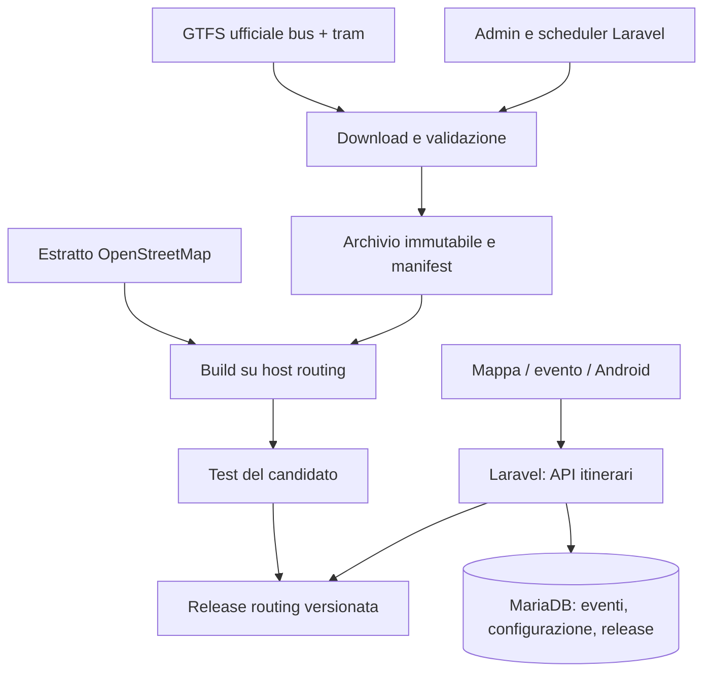

# Trasporto pubblico per raggiungere gli eventi a Padova

Piano e verifica delle fonti, 13 settembre 2026. Branch: `fix/padova-trasporto-pubblico`.

Questo documento progetta la funzionalità richiesta; non dichiara implementati
il journey planner, la pagina amministrativa o il cron. È stato scaricato e
ispezionato il GTFS tram ufficiale. Il benchmark dei motori non è ancora eseguito.

## 1. Proposta

Usare GTFS statici ufficiali per bus e tram e un estratto OpenStreetMap per i
percorsi pedonali. Provare **MOTIS per primo**, confrontandolo con OpenTripPlanner
sugli stessi dati e sulle stesse richieste. Laravel espone un contratto JSON
proprio: cambiare motore non deve richiedere di riscrivere sito e Android.

Il calcolo considera la posizione scelta dall'utente, la specifica data
dell'evento, i tratti a piedi, le attese e gli eventuali cambi. L'andata usa
«arriva prima dell'inizio»; il ritorno è una ricerca distinta, all'orario scelto.
Gli orari sono programmati: non si presentano previsioni di puntualità.

Non serve migrare database: Eventi usa già MariaDB e funzionalità spaziali.
I dati e il motore sono sotto il nostro controllo; «locali» significa sul nostro
server, non un planner offline nel telefono.

## 2. Cosa esiste davvero nei due progetti

### Eventi

- Laravel 13, PHP 8.4, Filament 5; Blade/Alpine e MapLibre; client Android nativo.
- `venues.transit` e `TransitGuide` sono indicazioni editoriali, non corse con
  calendario. Restano utili per ingressi, consigli e particolarità della sede.
- `EventOccurrenceQuery` governa visibilità e selezione delle date. Il planner
  deve passare da lì; non inventare una seconda definizione di «stasera».
- La destinazione si risolve dalla singola occorrenza con `effectiveVenue()` e,
  dove applicabile, dalla posizione personalizzata dell'evento. Un evento può
  cambiare sede tra due date. Una sede senza coordinate non genera un percorso.
- La mappa raggruppa per locale: nel foglio del pin si sceglie la data dell'evento
  prima di calcolare l'arrivo.
- `docs/DECISIONS.md` D3/D4 e `docs/AGENT-CONVENTIONS.md` prescrivono MariaDB,
  `POINT(lng, lat)` SRID 0 e query dietro `GeoQueryInterface`: non copiare lo
  schema MySQL SRID 4326 del piano esterno.
- L'hosting attuale è cPanel condiviso, senza Docker/demoni dedicati. Un processo
  permanente MOTIS/OTP e la costruzione del grafo richiedono un host separato.
  Il server del progetto mappe è un candidato da verificare per risorse e accesso;
  nessuna capacità o disponibilità è stata accertata in questa analisi.

### mappe / padova-live

Esaminati documentazione API, specifica OpenAPI e architettura del progetto
affiancato. Si possono riusare concetti: identificatori GTFS, fermate, direzioni,
colori, geometrie, distinzione tra orario e posizione live. La UI Expo non è un
componente riutilizzabile direttamente nella UI Blade/MapLibre di Eventi.

Le API PadoVia documentate espongono fermate, linee, passaggi e dettagli della
singola corsa; non costituiscono un'esportazione completa di corse e calendari
stagionali. Ricostruire gli orari interrogando tutte le paline perderebbe servizi
futuri, eccezioni e completezza. Il downloader userà ZIP GTFS, non quelle API.
I documenti allegati sono materiale di analisi: la loro scelta di un'app personale
e le istruzioni sugli header non diventano requisiti per Eventi.

## 3. Fonti e verifica pratica

La [pagina ufficiale Busitalia Veneto](https://gtfs-biv.fsbusitalia.com/) pubblica
collegamenti separati per BUS e TRAM, con archivi storici.

| Fonte | Esito del 13/09/2026 | Conseguenza |
|---|---|---|
| [GTFS bus](https://gtfs-biv.fsbusitalia.com/GTFS-BIV/gtfs-biv.zip) | HTTP 401; anche archivio protetto | Occorre accesso ufficiale prima del test completo bus + tram |
| [GTFS tram](https://gtfs-biv.fsbusitalia.com/GTFS-BIV-TRAM/gtfs-biv-tram.zip) | Scaricato, ZIP leggibile | Prova locale possibile |
| [Altro feed Busitalia](https://gtfs.fsbusitalia.com/google_transit/) | Ispezionato: agency `UmbriaMob`, 11.116 fermate, nessuna nell'area Padova verificata | Non è il feed Padova |

La landing non espone una licenza esplicita di riutilizzo. Registrare condizioni
e attribuzione della fornitura insieme alle credenziali, prima della distribuzione
pubblica. Il [registro accessi Busitalia](https://www.fsbusitalia.it/it/veneto/societa-trasparente/registro-degli-accessi.html)
documenta richieste GTFS accolte: è un percorso concreto per richiedere il feed bus.
Non sono stati inviati messaggi né richieste a terzi.

### Ispezione del tram scaricato

Archivio locale: `storage/app/private/transit/research/gtfs-biv-tram.zip`.
Rapporto: `storage/app/private/transit/research/tram-inspection.json`.
Sono file privati esclusi dal versionamento, non dataset da pubblicare nel repo.

- Dimensione: 199.566 byte.
- SHA-256: `d636d8316325be6c99049d8829ac76fe2d7e94fdc837d9c3d4a9b1b9a8af2f55`.
- 1 linea SIR1; 48 record fermata; 1.699 corse; 25.351 record di passaggio;
  2.763 punti delle geometrie.
- Calendario tramite `calendar_dates.txt`, senza `calendar.txt`: 31 date dal
  **13 settembre al 13 ottobre 2026**, incluse. Questo è ammesso da GTFS.
- Orari fino a `24:59:00`; 243 passaggi hanno ora almeno 24.
- Nei controlli eseguiti non risultano riferimenti mancanti da passaggi a corse
  o fermate, né da corse a shape. Non equivale a una validazione GTFS completa.
- `routes.txt` indica `SIR1` con `route_type=3` (bus). Per mostrare e filtrare il
  tram serve una regola circoscritta e testata `biv-tram/SIR1: 3 → 0`, conservando
  l'originale. Se il provider corregge il valore, la regola diventa un no-op;
  un valore inatteso deve produrre un errore visibile, non una riscrittura cieca.

Questi dati dimostrano perché non basta «scarica all'inizio della stagione»:
serve controllo giornaliero della disponibilità e della copertura effettiva.
La sola data massima non prova assenza di buchi intermedi: il report deve
espandere i calendari in giorni di servizio, per fonte e modalità.
Distinguere giorni dichiarati senza corse da date non fornite: l'assenza di
servizi attivi non basta a dedurre un errore o una scadenza. Per feed con sole
eccezioni, registrare quale evidenza definisce l'intervallo pubblicato
(`feed_info`, metadati ufficiali o intervallo osservato con limite esplicito).
L'intervallo osservato non dimostra la completezza di tutta l'offerta.

## 4. Scelta del motore

| Motore | Integrazione verificata | Valutazione per Eventi |
|---|---|---|
| MOTIS | REST JSON, OpenAPI, `GET /api/v6/plan`; GTFS + OSM; `arriveBy` | Primo candidato da misurare |
| OpenTripPlanner | GraphQL GTFS, `POST /otp/gtfs/v1`, `planConnection` | Confronto diretto; alternativa se dà risultati migliori o gestione più affidabile |
| Valhalla | Multimodal disponibile, ma `date_time.type=2` non implementato per multimodal | Escluso dal primo benchmark: manca «arriva entro» |

Fonti: [MOTIS OpenAPI](https://raw.githubusercontent.com/motis-project/motis/master/openapi.yaml),
[MOTIS repository](https://github.com/motis-project/motis),
[API OTP](https://docs.opentripplanner.org/en/latest/apis/Apis/),
[OTP planConnection](https://docs.opentripplanner.org/api/dev-2.x/graphql-gtfs/queries/planConnection),
[Valhalla API, date_time ed errore 141](https://valhalla.github.io/valhalla/api/route/api-reference/).

Non utilizzare esempi OTP REST vecchi: il REST è stato rimosso nel 2025; anche la
query GraphQL `plan` è deprecata. Le pagine `latest`, `master` e `dev-2.x` servono
per valutare oggi: nell'implementazione si bloccheranno versione binaria, schema
API e configurazione sul medesimo rilascio verificato.

GraphHopper, R5 e Navitia restano fuori dal primo esperimento per contenerne lo
scopo. Non sono stati benchmarkati e non viene confermata qui l'intera tabella
di capacità allegata. OSRM da solo non fornisce il planner GTFS richiesto.

## 5. Architettura e formati



| Livello | Formato | Regole |
|---|---|---|
| Orari e rete | GTFS Schedule, ZIP di CSV UTF-8 `.txt` | Originali immutabili; ID stringa, mai interi; namespace bus/tram |
| Camminate | `.osm.pbf` | Area della rete e margine per accessi e cambi; perimetro fissato e versionato |
| Config build | YAML o JSON secondo motore | Versione e hash; mai tag Docker `latest` |
| Provenienza | `manifest.json` + report validazione | Hash originali, normalizzati, OSM, regole, toolchain e copertura |
| Applicazione | JSON versionato | DTO indipendenti da MOTIS/OTP; tempi ISO 8601 con offset e timezone |
| Mappa | GeoJSON `FeatureCollection` | Coordinate `[lng, lat]`, LineString per tratta, Point per fermate |
| Futuro realtime | GTFS-RT Protobuf `.pb` | Layer aggiuntivo con timestamp e identificatori della medesima base statica |

GTFS richiesto: `agency`, `stops`, `routes`, `trips`, `stop_times` e almeno uno
fra `calendar` e `calendar_dates`. Conservare `shapes`, `transfers`, `frequencies`,
`pathways`, `feed_info` e altri file supportati se presenti. Applicare calendari
ed eccezioni, giorni scolastici/festivi, restrizioni salita/discesa e trasferimenti.
Non dedurre il calendario dall'etichetta «invernale» o da un PDF.
Riferimento: [GTFS Schedule](https://gtfs.org/documentation/schedule/reference/).

Gli orari GTFS oltre 24 vanno conservati come durata nella giornata di servizio,
senza modulo 24. Il motore deve applicare la semantica GTFS e il timezone
`Europe/Rome`, comprese transizioni DST: non usare conversioni manuali ingenue
da mezzanotte e non confondere service date con `business_date` degli eventi.

MOTIS restituisce geometrie encoded polyline a precisione 6; il progetto mappe
usa anche polyline a precisione 5. Gli adapter dichiarano esplicitamente la
precisione e restituiscono lo stesso GeoJSON ai client. Le shape GTFS descrivono
il mezzo: non sostituiscono la rete pedonale OSM.
Mostrare l'attribuzione OpenStreetMap e il collegamento alla licenza come
previsto dalla [documentazione OSM](https://www.openstreetmap.org/copyright).
Fonte PBF, poligono di estrazione e versione del tool di ritaglio devono entrare
nel manifest; la disponibilità dell'estratto non è stata verificata in questa prova.

### MariaDB

Proposta di tabelle applicative, tutte con Policy dove esposte:

- `transit_sources`: città, codice feed, provider, stato, riferimento endpoint
  consentito, riferimento credenziali cifrate e condizioni di utilizzo.
- `transit_import_runs`: chi/quando ha avviato, trigger admin/cron, stato enum,
  tentativi, errore, hash rilevati e percorso report.
- `transit_releases`: manifest, hash, motore/versione, configurazione,
  disponibilità per giorno/modalità, stato enum e indirizzo servizio versionato.
- `transit_deployments`: città, revisione, selezione release per data; aggiornamento
  atomico con confronto della revisione precedente.
- `transit_stops`, `transit_routes`, geometrie e associazioni solo per il catalogo
  mappa, sempre legati a `release_id`, con chiavi `(release_id, feed_id, gtfs_id)`.

Le fermate vicine passano da `Services/Geo`; le tabelle di corse e passaggi non
sono duplicate integralmente in MariaDB. Il motore possiede gli indici temporali;
il suo storage compilato è rigenerabile dagli input archiviati.

## 6. Aggiornamento meccanico e deterministico

Un'unica pipeline, avviabile da admin o scheduler. Nessun LLM, scraping di PDF,
ricostruzione per palina o modifica manuale degli orari.

1. **Lock e registrazione.** Una sola importazione per città, lock con lease e
   recupero da crash; vincolo univoco sulla fingerprint del candidato. La
   protezione vale anche per azioni manuali e retry, non solo per il cron.
2. **Acquisizione.** HTTP condizionale con ETag/Last-Modified se disponibili;
   scaricamento in staging con timeout, limiti byte/ZIP e hash SHA-256. Endpoint
   e redirect ammessi esplicitamente; credenziali mai nei log. `401` diventa
   «accesso alla fonte necessario», non un archivio vuoto o un retry infinito.
3. **Validazione.** CSV, file richiesti, ID/relazioni, coordinate, calendario
   espanso, stop sequence, salita/discesa, tempi, geometrie e copertura. Validator
   GTFS a versione fissata, più controlli applicativi e soglie di variazione
   definite. ZIP con path traversal, espansione eccessiva o dati inattesi rifiutati.
4. **Normalizzazione.** Regole dichiarative versionate, per esempio SIR1. Raw
   sempre preservato. Hash del contenuto canonico per evitare rebuild dovuti
   solo a timestamp/compressione ZIP; ordinamento CSV deterministico che conserva
   sequenze semantiche e molteplicità. Record incompatibili o duplicati non sono
   corretti silenziosamente. Un raw diverso rimane comunque nello storico.
5. **Bundle.** Bus, tram, OSM, parser, regole, config e versione motore formano
   un manifest immutabile. Non pescare un altro `latest` durante la build.
   Stessi input/config producono la stessa identità di release e risultati
   semanticamente ripetibili; non si presume un binario byte-identico se il
   motore incorpora metadati variabili.
6. **Build asincrona.** L'host routing costruisce una nuova release. Laravel
   accoda/legge uno stato; la richiesta HTTP admin e il worker cPanel non devono
   attendere una compilazione lunga. Richieste firmate/autenticate e idempotenti.
7. **Verifica.** Controlli di salute, compatibilità schema API, copertura delle
   due fonti, catalogo e itinerari campione. Dataset incoerente o perdita di
   servizio inattesa fermano la promozione, lasciando attiva la release precedente.
8. **Promozione.** Avviare il servizio candidato, verificarne l'ID, poi aggiornare
   atomicamente in MariaDB il riferimento alla release completa. Ogni richiesta
   fissa un `release_id` e usa catalogo e motore di quella release; il vecchio
   processo resta disponibile per le richieste già avviate. Questo evita di
   simulare una transazione distribuita tra filesystem e database.
9. **Conservazione e rollback.** Conservare release attiva, precedente e futura
   programmata, con quote di spazio e retention. Rollback al bundle completo,
   verificando che copra ancora la data richiesta. Non eliminare dati referenziati.

**Cambio stagione:** un feed futuro non rimpiazza quello valido oggi. Conservare
le release e una selezione per data di servizio: attuale prima del cambio, nuova
da quando entra in vigore. Non concatenare ZIP di versioni successive con gli
stessi ID. Il bundle può usare una fonte invariata e una nuova solo se le
coperture sono compatibili. Una ricerca notturna che attraversa il confine deve
essere coperta per l'intero intervallo, incluso il servizio del giorno precedente;
se serve unione, costruire esplicitamente un bundle con ID e calendari disgiunti
e validarlo. Senza questa copertura, non promettere risultati completi.

Il `304` evita un nuovo download, ma non evita i controlli di scadenza. Distinguere
fallimento di aggiornamento da inutilizzabilità: una release vecchia ma ancora
valida può continuare a servire, mostrando data aggiornamento; una data fuori
copertura non deve apparire come «nessun autobus».

### Scheduler proposto

Riutilizzare il cron Laravel esistente che esegue `schedule:run`:

- `transit:sync --due`: controllo frequente della scadenza del prossimo download;
  default download giornaliero alle 02:30 Europe/Rome, configurabile.
- `transit:reconcile`: avanzamento job remoti e promozioni pronte, ogni cinque
  minuti; ad ogni richiesta comunque si verifica la validità temporale.
- `transit:health`: controllo disponibilità/copertura; avviso admin a 7 e 3 giorni
  dalla fine dei dati, deduplicato. Un feed nuovo con copertura sotto soglia non
  passa automaticamente in stato sano.
- OSM: controllo mensile come default, aggiornamento manuale disponibile;
  acquisizione e build sull'host routing, non sul disco limitato del sito.

Comandi progettati, **non ancora presenti**. Retry con backoff e limite; monitor
esistente `ScheduledOperations`/`SchedulerOverview` e `schedule-monitor` per stato
del cron, storico import separato per fallimenti di download/build.

## 7. Admin e sidebar

Nuova voce **Sistema → Trasporto pubblico**, pagina Filament scoperta da
`AdminPanelProvider`, accessibile ad `admin`/`super_admin`. Autorizzazione anche
su ogni azione Livewire; moderatori e gestori locali non possono cambiare feed.

| Sezione | Campi e azioni |
|---|---|
| Stato | Bus e tram separati; release in uso; validità per modalità; ultimo controllo, ultima modifica, errore e prossima esecuzione |
| Fonti | Provider, endpoint ammessi, credenziali mascherate/cifrate, condizioni/attribuzione; prova accesso; eventuale upload ZIP ufficiale nella medesima pipeline |
| Aggiornamenti | Abilita automatico, cadenza/ora/timezone, soglie scadenza, retention, promozione automatica solo con tutti i controlli verdi |
| Itinerari | Abilita funzione, città/area, anticipo predefinito 15 minuti, massimo 2 cambi, camminata massima iniziale 15 minuti per accesso/uscita, finestra di ricerca 120 minuti |
| Motore | Stato, versione, copertura OSM e latenza; destinazione servizio e segreti in configurazione di sistema, non URL liberi inviati al browser |
| Storico | Hash, report, conteggi/differenze, patch applicate, autore/trigger, esito; scarica report |
| Azioni | Controlla aggiornamenti, importa ZIP, ricostruisci, programma/promuovi candidato verificato, ripristina release compatibile |

I limiti proposti sono default da calibrare nel benchmark, non orari del servizio.
Una pagina deve mostrare chiaramente «bus non configurato» anche quando il tram
è pronto. Modalità sperimentale solo tram ammessa solo se esplicitamente abilitata
e identificata come copertura parziale nel sito e nell'API.

Impostazioni applicative in `App\Settings\TransitSettings` con migration Spatie;
fonti e storico in modelli dedicati. Tutta la UI passa da `lang/it/transit.php`.

## 8. API propria di Eventi

Proposta: `POST /api/v1/transit/journeys`, risposta `private, no-store`, rate limit,
fuori dalla cache condivisa `CacheJsonResponse`. Il sito usa la stessa Action con
un endpoint web same-origin protetto secondo le convenzioni CSRF esistenti.
Nessuna posizione precisa negli analytics o nei log; oscurare body in Telescope
e Sentry. Nessuna posizione salvata automaticamente nel profilo.

Esempio di **contratto proposto**, coordinate e ID illustrativi, non percorso reale:

```json
{
  "occurrence_id": 123,
  "origin": {"lat": 45.4165, "lng": 11.8826},
  "direction": "outbound",
  "time_mode": "arrive_before_event",
  "arrival_buffer_minutes": 15,
  "max_transfers": 2,
  "max_walk_minutes": 15
}
```

Form Request valida coordinate finite, limiti, città, modalità e date. Il server
risolve destinazione e orario dell'occorrenza pubblica, senza fidarsi di un orario
evento passato dal client. Modalità aggiuntive `depart_at` e `arrive_by` accettano
un istante ISO 8601 esplicito; il ritorno inverte origine/destinazione con un
orario scelto dall'utente: `direction=return`, `time_mode=depart_at`, `at` ISO
8601. `origin` resta il punto dell'utente; in ritorno il server usa la sede come
partenza e quel punto come destinazione. Per eventi tutto il giorno o già iniziati si propone
«parti ora», non un arrivo impossibile nel passato.
In ogni ricerca operativa imporre anche partenza non precedente all'istante
attuale più il margine necessario per partire. Una query «arriva entro» può
altrimenti suggerire una corsa già partita. Se l'arrivo puntuale è impossibile,
proporre un eventuale arrivo tardivo solo come alternativa esplicitamente indicata.

Risposta normalizzata: `status`, `release_id`, `schedule_only`, `timezone`,
`coverage` per fonte, `warnings`, `itineraries[]`. Ogni itinerario contiene
partenza/arrivo, secondi totali/a piedi, numero cambi e `legs[]`.

Ogni tratta: `mode` WALK/BUS/TRAM; partenza/arrivo ISO 8601; metri; fermate
salita/discesa con ID e nome; codice linea e direzione; identificatori corsa
qualificati per feed/release; orari programmati; GeoJSON; numero fermate.
Campi transit nulli per camminata. Mai identificare una linea dal solo nome corto.

Stati distinti e testabili: `ok`, `no_itinerary`, `outside_feed_validity`,
`outside_service_area`, `partial_coverage`, `routing_unavailable`,
`destination_unavailable`. Una risposta vuota del motore non prova da sola che
«il servizio è terminato»: può dipendere da limiti di camminata/cambi/finestra.
Scrivere «nessun itinerario negli orari e limiti selezionati» quando non si può
attribuire una causa più precisa. Ricerca fallita per servizio indisponibile: 503;
input invalido: 422; evento non leggibile: 404.

Per MOTIS l'adapter traduce nel contratto documentato:

```text
GET /api/v6/plan
fromPlace=45.4165,11.8826
toPlace=45.3986,11.8768
time=2026-09-20T20:45:00%2B02:00
arriveBy=true
timetableView=false
transitModes=BUS,TRAM
preTransitModes=WALK
postTransitModes=WALK
```

È un esempio dei parametri API, non una chiamata eseguita su un grafo Padova.
Il client HTTP esegue l'encoding; non concatenare query a mano. Limiti e
preferenze aggiuntivi si mappano dopo aver fissato lo schema del rilascio scelto.
Niente modalità `radius` che sostituisca OSM con accessi in linea d'aria.

Adapter OTP: GraphQL `planConnection`, `origin`, `destination`,
`dateTime.latestArrival` o `earliestDeparture`, modalità e preferenze secondo
schema della release fissata. Anche errori GraphQL dentro una risposta HTTP 200
sono errori applicativi; validare risposta e geometrie prima di mostrarle.

## 9. Esperienza utente

Nella pagina evento, «Arriva con i mezzi» richiede la posizione soltanto dopo
un'azione esplicita. Se negata o imprecisa, l'utente sceglie un punto in mappa;
l'inserimento indirizzo può riusare il geocoder esistente con le sue condizioni.
Per eventi con più date il selettore è obbligatorio prima del calcolo.

Mostrare fino a tre alternative non dominate: arrivo utile, durata, camminata,
cambi. Prima i percorsi che rispettano l'arrivo desiderato; poi confronto
esplicito «meno cambi»/«meno camminata». Ordinamento stabile con tie-breaker sugli
ID delle tratte, stessi input e stessa release. Non spacciare una scelta per
più affidabile senza dati reali. Un percorso interamente pedonale va etichettato.

Esempio di presentazione, **senza inventare linee o orari**:

```text
Arriva entro le [orario evento meno anticipo]
[durata] · [numero cambi] · [minuti a piedi]
Cammina fino a [fermata]
[Bus/Tram linea] verso [direzione] · [partenza] → [discesa]
[eventuale cambio e seconda linea]
Cammina fino a [ingresso/sede]
Orari programmati · dati aggiornati il [data]
[Controlla il ritorno]
```

In mappa: azione sulla singola data nel foglio del locale; tratte colorate e
camminate tratteggiate, fermate e direzione, adattamento inquadratura. Catalogo
linee/fermate facoltativo e caricato per area/zoom/release, non un dump di tutti
i passaggi nel frontend. Timeline testuale accessibile anche senza mappa.

Per la sera offrire il controllo del ritorno. La fine stimata da
`effective_ends_at` può suggerire un orario da confermare, mai essere presentata
come fine reale. «Ultimo ritorno» si mostra soltanto dopo una ricerca inversa
completa entro un limite dichiarato, non deducendolo dall'ultima corsa di una
singola linea. Se fuori calendario, «orari non ancora disponibili».

## 10. Sequenza di implementazione e verifica

1. **Dati:** accesso bus e condizioni; archivio tram già acquisito; downloader,
   validator, manifest e regole; report calendario. Gate: due fonti complete e
   valide per gli scenari richiesti. Nessun falso dataset bus di ripiego.
2. **Prova MOTIS/OTP:** stesso bundle completo Padova e stesso estratto OSM;
   scegliere 3–4 linee come scenari, non tagliare il feed a 3–4 linee perdendo
   interscambi. Eseguire su stessa macchina con risorse dichiarate.
3. **Operazioni:** release immutabili, build remota, promozione atomica, rollback,
   scheduler e pagina admin/sidebar; test di concorrenza e crash.
4. **Backend:** interfaccia `JourneyPlanner`, adapter scelto, DTO, Form Request,
   Action di risoluzione evento/data, endpoint web/API e contratti documentati.
5. **Web:** componente condiviso in evento e foglio mappa, geolocalizzazione,
   timeline/GeoJSON, stati errore, ritorno. Nessun contenuto personalizzato in
   cache condivisa. Riutilizzare l'aspetto dell'app senza sostituire la mappa.
6. **Android:** medesimo JSON e risoluzione occorrenza; UI e permessi coerenti,
   fase esplicita prima di dichiarare disponibile la funzione su tutti i client.
7. **Attivazione:** solo dopo test con dati reali e verifica dell'host permanente.

Punti di integrazione esistenti:

```text
app/Queries/EventOccurrenceQuery.php
app/Models/EventOccurrence.php
app/Http/Controllers/Web/EventController.php
app/Http/Resources/V1/OccurrenceResource.php
resources/views/events/show.blade.php
resources/views/map/sheet.blade.php
resources/js/map.js
app/Services/Map/MapPayload.php
app/Providers/Filament/AdminPanelProvider.php
app/Filament/Admin/Pages/ScheduledOperations.php
routes/console.php
```

Nuovi componenti previsti: `app/Services/Transit/`, `app/DTOs/Transit/`,
`app/Actions/PlanEventJourney.php`, `app/Settings/TransitSettings.php`,
`app/Filament/Admin/Pages/PublicTransport.php`, modelli/migrazioni transit,
comandi e job, `lang/it/transit.php`, componente Blade e modulo JS dedicati.

### Benchmark con criteri di decisione

Misurare durata build, memoria massima build/runtime, spazio, cold start,
latenza p50/p95 e correttezza. Target iniziale p95 ≤ 2 secondi end-to-end sotto
carico concordato; nessuna stima RAM/costo presentata come già misurata.
Correttezza obbligatoria: arrivo entro la soglia, camminate percorribili,
cambi temporalmente fattibili, modalità e date coerenti col feed.

Scenari: tram diretto; bus diretto; bus→tram; bus→bus; camminata più conveniente;
feriale/festivo/scolastico; ultima corsa; dopo mezzanotte; nessun servizio;
evento oltre calendario; limite stagione; sede variabile; origine fuori area.
Fixture sintetiche separate coprono DST e casi non presenti nel feed del mese.
Controllo degli itinerari sui passaggi GTFS e, a campione, sugli orari ufficiali.
Il motore scelto è quello che passa tutti i casi necessari sul target; la
preferenza MOTIS è provvisoria, non il risultato di un benchmark inesistente.

### Test della pipeline e dell'app

- Stesso input due volte: nessuna doppia build/promozione; ZIP ricompresso con
  stessi record: nuova evidenza raw ma identico contenuto canonico.
- `401`, timeout, HTML al posto dello ZIP, archivio corrotto, ID mancanti,
  ZIP ostile, feed vuoto/scaduto e improvvisa perdita linee: nessuna promozione.
- Patch SIR1 applicata una volta; upstream corretto riconosciuto; altro valore
  inatteso segnalato. ID bus/tram sovrapposti non si confondono.
- Calendario solo eccezioni, ore 24+, DST, cambio stagione e copertura parziale.
- Crash download/build/promozione, doppio cron/admin, rollback e disco pieno:
  servizio attivo consistente, errori e stato import visibili.
- Occorrenza non pubblica/annullata, sede alternativa, timezone; niente leak
  di origine in cache/log e niente indirizzi arbitrari verso l'host routing.
- Arrivo richiesto a breve con itinerario già partito: rifiuto; ritorno con
  inversione corretta; giorno coperto senza corse distinto da data non fornita.
- Browser: posizione negata, mobile, cambio data durante richiesta (ignorare
  risultati obsoleti), tastiera, testo senza colori/mappa, limite camminata.
- Verifica Pest con DB di test isolato, Pint, PHPStan, build Vite e test browser;
  test Android nella relativa fase, senza eseguire reset su database reali.

## 11. Cosa resta necessario prima del servizio completo

Accesso al GTFS bus ufficiale, condizioni d'uso, verifica dell'host per routing
e benchmark reale. Non bloccano la progettazione qui completata, ma impediscono
di dichiarare oggi disponibili suggerimenti completi bus+tram in produzione.
Il realtime futuro potrà arricchire gli stessi itinerari con ritardi/avvisi,
senza sostituire gli input statici né il meccanismo di aggiornamento stagionale.

## 12. Verifica successiva: client PadoVia e download dal browser

Su richiesta del proprietario sono stati letti direttamente `src/net/headers.ts`,
`rest.ts`, `cache.ts`, `src/store.ts` e `src/ui/Detail.tsx` di `mappe/padova-live`.
Il client chiama `api.padovia.it`, non il download ZIP di Busitalia. Usa gli
header Chrome Android/Origin/Referer documentati; ETag per richieste condizionali,
cache persistente del catalogo, TTL 60 secondi sui passaggi e invalidazione delle
corse quando cambia la versione del catalogo fermate.

Test del 13 settembre 2026, risposte salvate in privato sotto
`storage/app/private/transit/research/header-test/`:

| Chiamata | Esito |
|---|---|
| ZIP ufficiale bus, senza e con header PadoVia | Entrambe 401, `WWW-Authenticate: Basic` |
| PadoVia `/biv/routes` | 200, 97 linee |
| PadoVia `/biv/stops` | 200, 3.875 fermate |
| `/biv/stops/7603?limit=25` | 200, 25 passaggi di Padova Autostazione |
| `/biv/trips/586890` | 200, corsa E015V delle 20:10, 7 fermate e geometria |
| Stessa fermata, `after=2026-09-14T08:00:00+02:00` | 200, 25 passaggi futuri |

Quindi gli orari bus sono accessibili tramite PadoVia; il 401 del provider non
dimostra indisponibilità di queste API. Resta da verificare se paginazione,
identificatori e orizzonte pubblicato consentano di produrre un GTFS completo:
il test di una fermata non prova copertura stagionale. I cataloghi linee e
fermate restituiscono versioni di formato diverso (data e UUID): non confrontarle
come se fossero lo stesso identificatore di snapshot.

Il proprietario chiede ora di creare lo ZIP da PadoVia per tutto il periodo
disponibile, preferendo un eventuale download già esposto dal browser. Sul sito
pubblico `www.padovia.it/it/` non è emerso un collegamento GTFS. L'app nel browser
presenta un modulo di accettazione termini: la sezione «Proprietà e utilizzo dei
dati» limita l'uso alla consultazione personale ed esclude estrazione massiva e
servizi derivati. I termini non sono stati accettati dall'assistente. Questo
non è un errore HTTP delle API; l'ispezione ulteriore dell'interfaccia richiede
una decisione esplicita del proprietario sull'accettazione.

### Esito della verifica completa nel browser e dell'API

Il proprietario ha successivamente autorizzato l'accettazione dei termini: è
stata eseguita nel browser e la mappa PadoVia si è aperta. Non è emersa una
funzione di download GTFS nell'interfaccia esaminata; nemmeno il bundle pubblico
caricato dalla pagina contiene un riferimento `.zip` o un endpoint GTFS.
L'accettazione dei termini del sito non è un'autorizzazione del fornitore al
riutilizzo dei dati. Eventuali nuovi termini non vanno accettati automaticamente.

Ulteriori nove richieste circoscritte, archiviate come `bounded-*.json`, hanno
mostrato che `after` è inclusivo e che `before` non limita superiormente una
finestra: può restituire una parte precedente non limitata a 200 record,
insieme ai primi 200 successivi. Paginarlo come un normale intervallo perderebbe
corse. Anche aggiungere un millisecondo all'ultimo timestamp può perdere
passaggi simultanei oltre il limite. Una pagina satura con un unico timestamp
non ha un cursore secondario documentato con cui avanzare senza perdite.

Gli orari bus del 30 settembre e del primo ottobre sono interrogabili; il 12 e
13 ottobre la fermata verificata restituisce vuoto. Non è una prova di fine
calendario globale. L'API non espone l'elenco completo di corse, calendari
originali, orizzonte globale e tutte le restrizioni di salita/discesa.
Un archivio ricostruito può descrivere solo date/corse osservate; non soddisfa
la richiesta di esportare e aggiornare deterministicamente **tutto il periodo
disponibile** senza lacune non rilevabili. Non deve essere promosso come feed
completo per la raccomandazione dei percorsi.

Verificata anche una fonte alternativa pubblicamente indicizzata, BusOne:
`https://proxy.busone.app/` ha restituito errore 522. Nessun feed acquisito da
questa fonte. Come preparazione tecnica sono stati scaricati in storage privato
MOTIS 2.11.3 per macOS arm64 (eseguibile avviato con successo in modalità help)
e l'estratto Geofabrik Nord-Est `.osm.pbf`. Non è stato costruito un grafo né
attivato un servizio di routing o un aggiornamento periodico.

Stato: branch isolato, nessun merge; pianificazione e verifica fonti completate.
La funzionalità evento/mappa/admin non è implementata. Per completare il piano
con copertura bus+tram serve il GTFS bus completo o un'esportazione equivalente
del provider con calendario e condizioni d'uso definite. Il GTFS tram originale
è disponibile localmente e resta valido per una prova esplicitamente solo tram.

## 13. Verifica dei repository pubblici PadoVia

Il 13 settembre 2026 l'organizzazione espone quattro repository pubblici:
`.github`, `GTFSFixerAI`, `tpl-avl-daemon`, `vehicle-trip-matcher`.
Gli ultimi tre sono archiviati. Esaminati codice del ramo principale, alberi
degli altri rami pubblici e release (nessuna nei tre progetti applicativi).
Copie per analisi in storage privato; nessun codice esterno eseguito.

- [vehicle-trip-matcher, trip-finder.js](https://github.com/PadoVia/vehicle-trip-matcher/blob/main/src/trips/trip-finder.js)
  contiene query su `gtfs_versions`, `stops_data`, `trips_data`,
  `stop_times_data`, `calendar_dates_data` e tabelle di associazione alle versioni.
  Seleziona la versione attiva più recente per `import_date` e i servizi del
  giorno precedente per gli orari oltre 24. È evidenza concreta di dati GTFS
  con calendario nel loro backend pubblicato, non di un download integrale
  inviato al browser. Il repository non include l'importatore o un export ZIP.
- [GTFSFixerAI, readme_it.md](https://github.com/PadoVia/GTFSFixerAI/blob/main/readme_it.md)
  richiede che l'operatore fornisca già `storage/gtfs/biv/stops.json` e
  `routes.json`. Il [.gitignore](https://github.com/PadoVia/GTFSFixerAI/blob/main/.gitignore)
  esclude questi dati. Lo scraper legge notizie di deviazioni e il modulo AI
  propone modifiche: non scarica gli orari completi e non è il meccanismo
  deterministico richiesto per Eventi.
- [tpl-avl-daemon, modulo Busitalia](https://github.com/PadoVia/tpl-avl-daemon/blob/main/operators/busitalia_veneto_padua.js)
  usa credenziali/configurazione lato server: Bearer per AVL e Basic per
  GTFS-Realtime. Questo prova l'uso di accessi autenticati per quei servizi;
  non prova quali credenziali o quale fonte usino oggi per il GTFS statico.

Nessuno ZIP GTFS, dataset completo o endpoint pubblico di esportazione individuato
in questi repository. Non si può assumere che descrivano integralmente il sito
attuale, essendo archiviati. Sono utili il modello di versionamento e il trattamento
esplicito della giornata di servizio; il trip matcher GPS non è un journey planner.

Il [profilo pubblico](https://github.com/PadoVia/.github/blob/main/profile/README.md)
invita a collaborazioni e condivisione dati tramite `staff@padovia.it`.
Un export statico completo con calendario e versione sarebbe sufficiente per
evitare la ricostruzione per palina. Nessun contatto inviato in questa sessione.

## 14. OpenStreetMap e ÖPNVKarte: API provate e dati estraibili

Verifica del 13 settembre 2026 sui link forniti dall'utente:
[wiki Padova](https://wiki.openstreetmap.org/wiki/Padova#Public_transport),
[rete 382350](https://www.openstreetmap.org/relation/382350),
[ÖPNVKarte](https://www.xn--pnvkarte-m4a.de/).
La wiki è datata, ma la relazione di rete corrente è versione 35 del
20 marzo 2026. I suoi 33 membri sono 32 varianti bus e una direzione tram:
non sono 33 linee distinte e non certificano la completezza della rete.
Alcune relazioni hanno `opening_hours`, cioè annotazioni delle fasce di servizio,
non partenze per fermata o calendari stagionali verificati.

Scaricato e analizzato il bundle pubblico ÖPNVKarte `main-B9sEDPS4.js`.
Oltre alle tessere cartografiche, il client usa questi endpoint effettivi:

| Endpoint GET | Prova e contenuto |
| --- | --- |
| `https://tileserver.memomaps.de/api/route/365296/stops` | HTTP 200, 21 fermate SIR1 verso Pontevigodarzere |
| `https://tileserver.memomaps.de/api/route/377204/stops` | HTTP 200, 33 fermate bus 10 verso Sarmeola |
| `https://tileserver.memomaps.de/api/station_routes?s=1550619` | HTTP 200, Capolinea Sud: bus 88 e due direzioni SIR1 (relazioni 1783009 e 365296) |
| `https://tileserver.memomaps.de/api/station_routes?w=...` | Presente nel client per piattaforme; il tentativo con ID way OSM 562307735 restituisce 400, identificatore corretto non verificato |
| `https://tileserver.memomaps.de/api/search?q=Padova&bbox=11.80,45.35,12.00,45.48` | HTTP 200, risposta JavaScript `renderSearchResults(...)`, ricerca luoghi con attribuzione LocationIQ, non orari |
| `https://api.openstreetmap.org/api/0.6/relation/365296/full.json` | HTTP 200: relazione, 37 way e 787 nodi per ricostruire le geometrie |

`route/{id}/stops` restituisce array ordinati di `name`, `id`, `stop_id`,
`geom`, `forward`. Le geometrie sono WKT `POINT` in coordinate metriche
Web Mercator: lo stesso client le converte in longitudine/latitudine.
`station_routes?s=` usa l'ID interno `id` della risposta fermate (1550619
nella prova), non l'ID nodo OSM o il grande `stop_id`: entrambi hanno dato
risposta vuota nelle prove. I grandi identificatori vanno preservati senza
arrotondamento JavaScript. Non usare l'ordine o `forward: null` per dedurre
calendari, tempi o restrizioni di salita/discesa.

Il bundle esaminato non contiene endpoint GTFS o timetables. Le risposte
verificate non contengono orari. Le FAQ dichiarano origine cartografica
OpenStreetMap e rimandano a Planet/Geofabrik per i dati scaricabili.
La seconda direzione SIR1 trovata attraverso la fermata mostra inoltre che
la relazione di rete da sola non basta a enumerare tutte le varianti.

Risposte conservate in `storage/app/private/transit/research/osm/`.
Creata prova reale `sir1-osm.geojson`: membri della relazione SIR1 in GeoJSON
WGS84, con ruolo e sequenza originali, geometrie delle way e fermate.
È un insieme di geometrie OSM, non un itinerario calcolato né un GTFS.

Per Eventi: estratto `.osm.pbf` versionato per rete pedonale e cartografia,
GeoJSON WGS84 per visualizzazione, GTFS ZIP separato per corse e calendari.
L'aggiornamento riproducibile deve conservare snapshot, checksum, versione
dell'estrattore e controlli di integrità prima dell'attivazione atomica.
Queste API sono utili per verifica e scoperta; per l'importazione periodica
massiva preferire i dati OSM originali, senza dipendere dai server delle tessere.
Nessuna nuova fonte di orari bus completi identificata in ÖPNVKarte.
